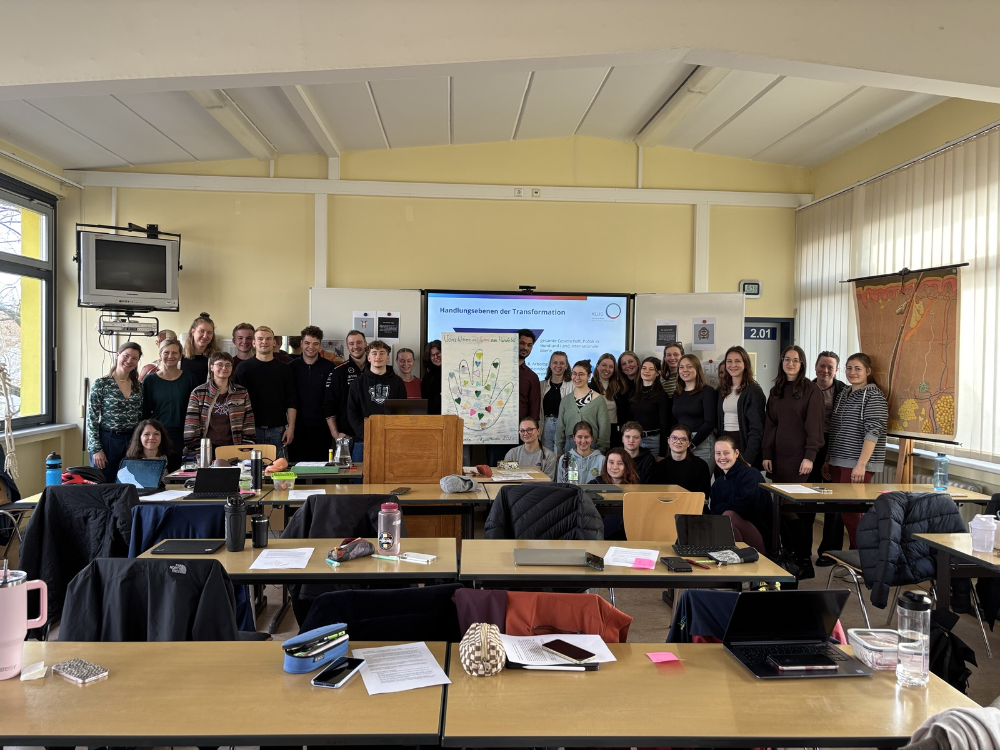
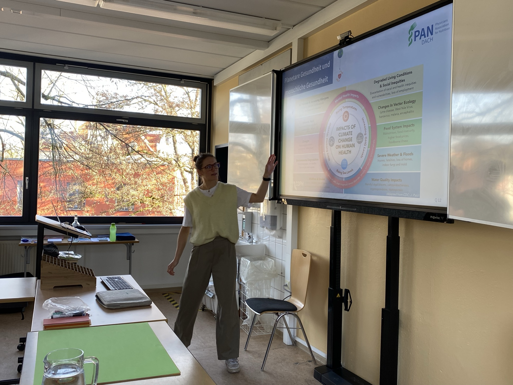
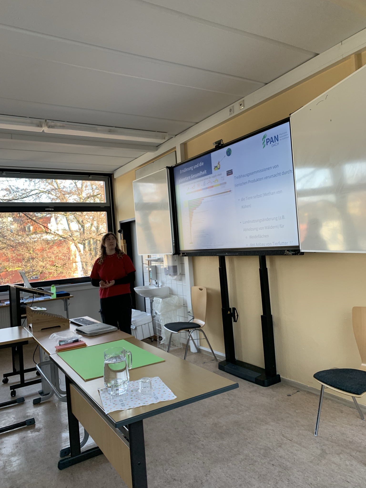
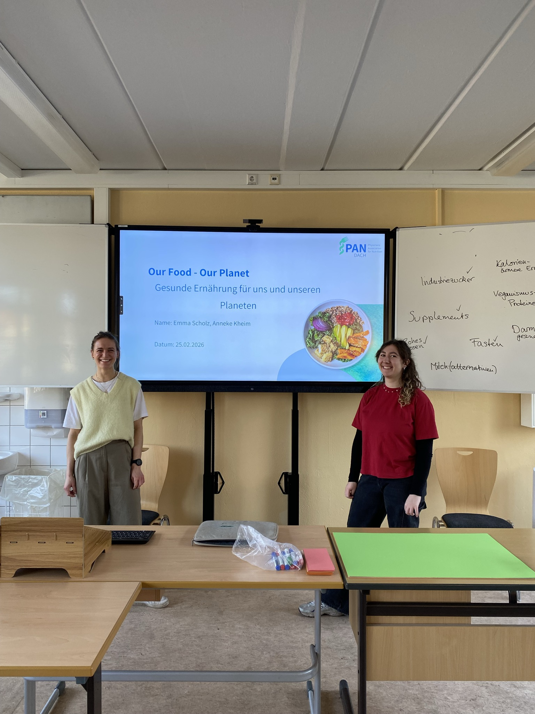

An der Carus Akademie am Uniklinikum Dresden haben angehende Physiotherapeut:innen im Rahmen einer interprofessionellen Projektwoche im Februar 2026 das Thema Planetary Health erkundet.

In Zusammenarbeit mit Engagierten von „Health for Future Dresden“ wurde eine Einführungsvorlesung zu Planetary Health und der Nachhaltigkeitsinitiative am Uniklinikum „Carus Green“ sowie vertiefend praxisnahe Workshops zu Themen wie Hitze und Luftverschmutzung, der Planetary Health Diet (inklusive gemeinsamer Koch-Session!) sowie Klimagefühlen und klimasensibler Gesundheitsberatung durchgeführt.

Ein Projekt, das die Ausbildung zukunftsfähig macht!

{width='47%' group='2026-03-01' .lightbox}
{width='47%' group='2026-03-01' .lightbox}
{width='47%' group='2026-03-01' .lightbox}
{width='47%' group='2026-03-01' .lightbox}