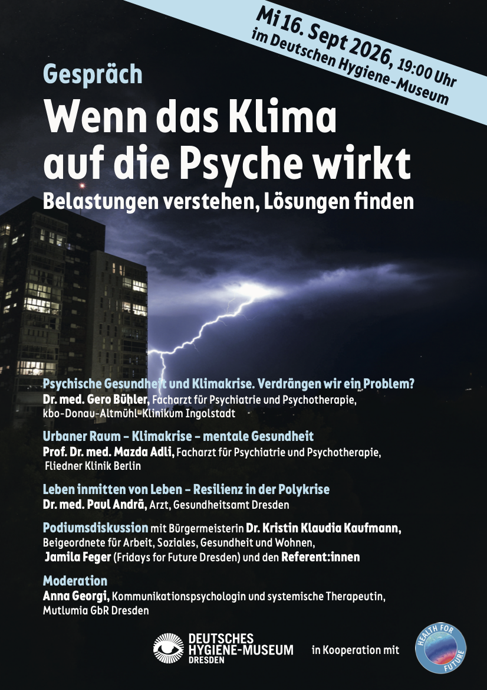

Die Klimakrise ist längst nicht mehr nur eine Bedrohung für unsere physische Umwelt. Sie wirkt sich auch auf unser psychisches Wohlbefinden aus: Zukunftsängste, Sorgen, Stress und Ohnmachtsgefühle nehmen angesichts der Klimaveränderungen und zunehmender Krisen zu. Besonders im urbanen Raum stellt sich die Frage, wie wir gesund leben und mit den Herausforderungen der Klimakrise umgehen können.

Health for Future Dresden lädt zu einer interdisziplinären Veranstaltung ins Deutsche Hygiene-Museum Dresden ein. Gemeinsam mit Expert:innen wollen wir die Zusammenhänge zwischen Erderwärmung, Stadt und mentaler Gesundheit beleuchten.

Im Mittelpunkt stehen dabei nicht nur die Belastungen, sondern auch mögliche Wege zu mehr persönlicher und gemeinschaftlicher Resilienz. Was kann jede*r Einzelne tun? Welche Verantwortung und Gestaltungsmöglichkeiten haben Städte und Gemeinden? Und wie können wir Ohnmachtsgefühle in konstruktives Handeln verwandeln?

Im Anschluss an die Impulsvorträge diskutieren die Referent:innen gemeinsam mit Vertreter:innen aus Politik und Zivilgesellschaft über konkrete, gesunde Zukunftsperspektiven für Dresden. Die Veranstaltung bietet Raum für Austausch, Fragen und die gemeinsame Suche nach Lösungen.

Wir freuen uns darauf, mit Ihnen ins Gespräch zu kommen und darüber zu diskutieren, wie eine klimaresiliente und psychisch gesunde Zukunft für alle gestaltet werden kann.