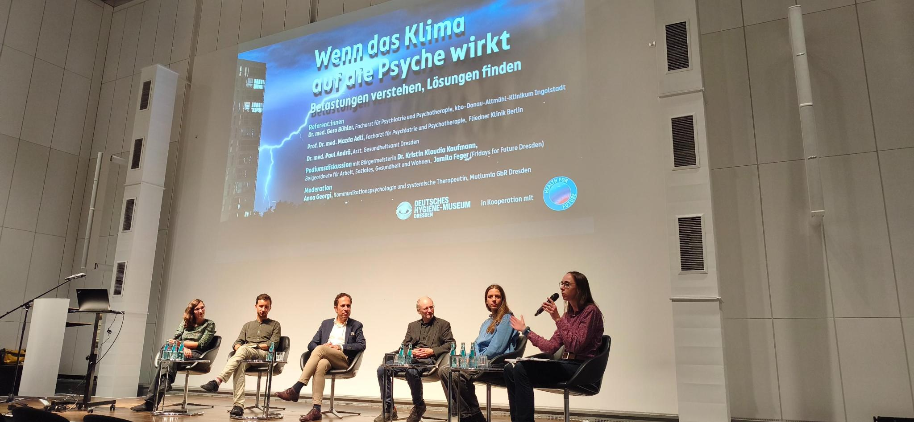
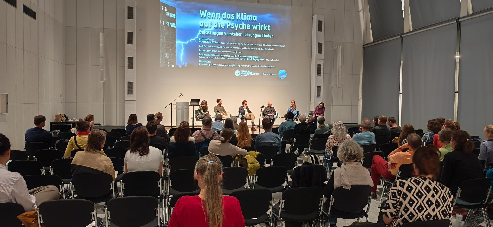

Am 16. September 2026 fand im Deutschen Hygiene-Museum Dresden die Veranstaltung „Wenn das Klima auf die Psyche wirkt – Belastungen verstehen, Lösungen finden“ statt. Im Mittelpunkt standen die psychischen Auswirkungen der Klimakrise, der Einfluss von Stadtplanung auf die mentale Gesundheit sowie Möglichkeiten, Resilienz und Handlungsfähigkeit zu stärken.

Dr. med. Gero Bühler gab zunächst einen Überblick über die Zusammenhänge zwischen Klimakrise und psychischer Gesundheit. Darüber hinaus ging es um gesellschaftliche Reaktionen auf die Klimakrise – etwa Verdrängung angesichts der Bedrohung.

Prof. Dr. med. Mazda Adli beantwortete die Frage, wie Stadtplanung die psychische Gesundheit beeinflusst. Grünflächen, attraktive und sichere Begegnungsorte, aber auch die Anordnung der Straßen und Wege können das Wohlbefinden stärken. 

Anschließend richtete Dr. med. Paul Andrä den Blick auf die Frage, wie sich Resilienz und psychische Gesundheit trotz der vielfältigen Krisen individuell stärken lassen, Schlüsselbegriffe sind dabei „Diversität“ und „Konnektivität“.

Eine weitere Perspektive brachte Jamila Feger, Mitglied bei Fridays for Future Dresden, ein. Anhand persönlicher Erfahrungen wurde deutlich, welche Formen von Gemeinschaft, Austausch und aktivem Handeln dabei helfen, psychisch gesund und handlungsfähig zu bleiben.

In der anschließenden Podiumsdiskussion wurde gemeinsam erörtert, was die Erkenntnisse konkret für Dresden bedeuten. Im Mittelpunkt standen die Rolle der Stadt, kommunale Klimaschutzmaßnahmen, eine gesundheitsfördernde Stadtplanung sowie die Bedeutung sozialer Begegnungsräume.

Auf dem Podium diskutierten Dr. Kristin Klaudia Kaufmann, Beigeordnete für Arbeit, Soziales, Gesundheit und Wohnen der Landeshauptstadt Dresden, Jamila Feger von Fridays for Future Dresden sowie die Referent:innen. Moderiert wurde die Veranstaltung von Anna Georgi, Kommunikationspsychologin und systemische Therapeutin bei Mutlumia GbR Dresden.

Informationsstände von Psychologists/Psychotherapists for Future Dresden, Mein Baum – Mein Dresden und Health for Future Dresden boten Gelegenheit, sich weiter zu informieren, miteinander ins Gespräch zu kommen und sich zu vernetzen.

Die Veranstaltung machte deutlich: Die Klimakrise ist auch eine Herausforderung für die psychische Gesundheit. Gleichzeitig können Klimaschutz, eine lebenswerte Stadtgestaltung und gemeinschaftliches Engagement dazu beitragen, Gesundheit zu stärken.
